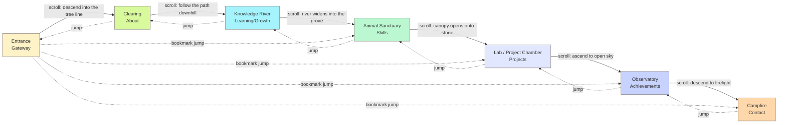

# Scene Graph — The Seven Locations

## Flow

The primary path is linear and scroll-driven. A secondary, dashed set of edges represents free
navigation (keyboard shortcuts / scene bookmarks from Phase 4) — always available, never the
default expectation.

Bookmark jumps (Phase 4) always land at the *start* of a chapter and play a short settle
transition (never a hard cut) so the world state (time-of-day, fog, audio) has somewhere to
animate from — jumping never breaks continuity, it compresses it.

## Per-location spec

### 1. Entrance — Gateway
- **Narrative job:** first impression; a calm, confident invitation, not a spectacle dump.
- **Complexity tier:** minimal. One focal point (a threshold — an arch of roots/stone), soft
  volumetric light through a gap in the canopy.
- **Time-of-day default:** dawn (the journey begins at first light).
- **Foreground:** framing foliage, mostly still, gentle sway only.
- **Midground:** the threshold itself — the single interactive/focal element (subtle Aether
  glow tracing the arch, responds gently to scroll intent).
- **Background:** distant tree line, heavy soft fog, sky.
- **Exit:** scroll pulls the camera *through* the threshold into the Clearing — the one moment
  in the whole journey with a genuine "passing through" camera move.

### 2. Clearing — About
- **Narrative job:** who I am, what drives me. Human-scale, unhurried.
- **Complexity tier:** minimal-to-low. A single clearing, dappled light.
- **Foreground:** grass/wildflowers, minimal parallax.
- **Midground:** the "about" narrative surface — text integrated into the environment (carved
  into a stone, grown into bark) rather than a floating card.
- **Background:** forest wall, soft depth-of-field.
- **Aether presence:** none, or barest hint — this chapter is pure nature, establishing the
  baseline the rest of the journey will complicate.

### 3. Knowledge River — Learning, iteration, growth
- **Narrative job:** a flowing path motif for continuous learning; the river *is* the timeline.
- **Complexity tier:** low-to-medium. Introduces motion as a first-class element (current,
  reflection) but still calm.
- **Foreground:** reeds/rocks at the bank, slow parallax.
- **Midground:** the river itself — Aether now visibly present as the current's glow,
  established as "the thing that flows through everything."
  Milestones (courses, certs-in-progress, iteration moments) sit as stones/eddies along the bank,
  revealed as the camera travels downstream.
- **Background:** forest opening up, hills.
- **Time-of-day progression begins here:** dawn → day crossfade starts around this chapter.

### 4. Animal Sanctuary — Skills
- **Narrative job:** skills as symbolic/mechanical creatures, one per domain, with believable
  idle states and wildlife-choreographed movement paths — not static posed models.
- **Complexity tier:** medium. First chapter with several simultaneously "alive" elements, still
  bounded by the motion budget (§4 of design spec).
- **Foreground:** undergrowth the creatures move through.
- **Midground:** the creatures themselves — each a small idle loop (breathing, occasional
  glance, patrol path along a fixed curve) with Aether-lit markings sized/intensity-mapped to
  skill proficiency.
- **Background:** denser grove, filtered light.
- **Interaction:** hover/focus on a creature reveals its skill detail via the shared UI chrome,
  without pulling it out of its environment (no card popping over the scene).

### 5. Lab / Project Chamber — Projects
- **Narrative job:** projects as artifacts/chambers/machines; this is the first chapter that
  looks *built* rather than grown — nature and structure visibly merging (wood-grain circuitry,
  stone consoles).
- **Complexity tier:** medium-high. Structured, denser framing is allowed here per the design
  spec's "later = denser" rule.
- **Foreground:** chamber architecture framing the shot.
- **Midground:** one artifact/machine per project; interacting opens the deep-dive view
  (architecture, outcome, visuals) and a focused case-study mode for recruiters.
- **Background:** the chamber recedes into structured dark, Aether conduits tracing the walls.
- **Time-of-day:** sunset — the visual "weight" of the day.

### 6. Observatory — Achievements, certs, blog, metrics
- **Narrative job:** proof of work, presented as a ceremonial timeline/wall rather than a resume
  table — a night-sky instrument reading the visitor's journey back at them.
- **Complexity tier:** high — the most "instrumented" chapter (this is where JetBrains Mono
  appears, per the typography system).
- **Foreground:** observatory structure framing an open sky.
- **Midground:** the certification wall/timeline, live metrics (GitHub activity, blog), each
  presented with date/issuer/significance rather than a logo grid.
- **Background:** night sky, stars standing in for the Aether at its most diffuse and expansive.
- **Time-of-day:** night.

### 7. Campfire — Contact
- **Narrative job:** calm emotional close. Deliberately the simplest chapter after the Lab and
  Observatory's density — the story exhales.
- **Complexity tier:** minimal again, mirroring the Entrance (bookend structure).
- **Foreground:** fire-lit ground, embers (the Aether's final form — literal warm light now,
  closing the motif that began as a cool river current).
  Reduced-motion mode: it's the one place where a slow ember drift is worth keeping even with
  motion reduced, at very low amplitude — the calmest possible motion, not zero necessarily; see
  [07-accessibility-and-testing.md](./07-accessibility-and-testing.md) for the exact rule.
- **Midground:** the visitor's own vantage at the fire; contact links, socials, resume export
  presented as calm, direct UI — no more environmental storytelling tricks at this point, the
  journey has earned a direct ask.
- **Background:** dark forest, fire glow falloff.
