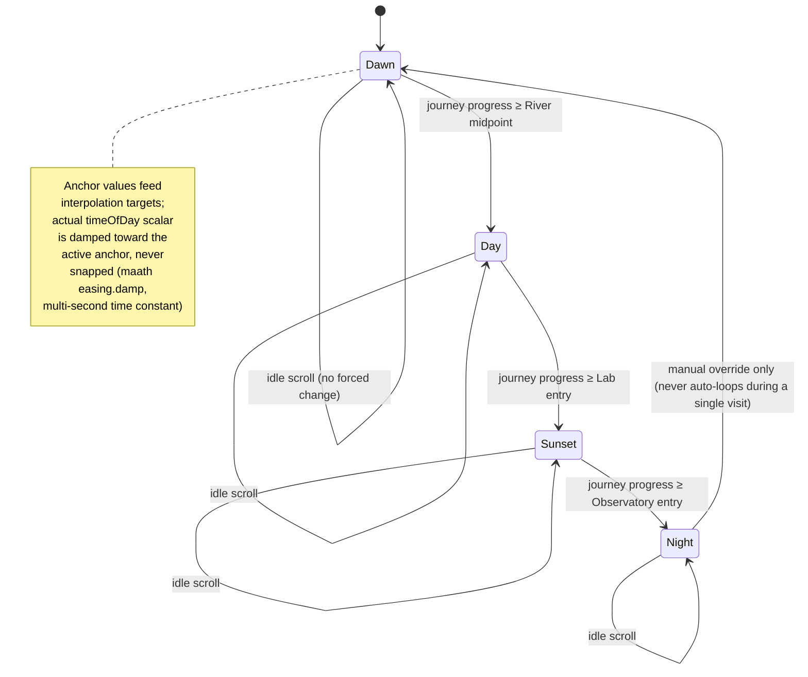
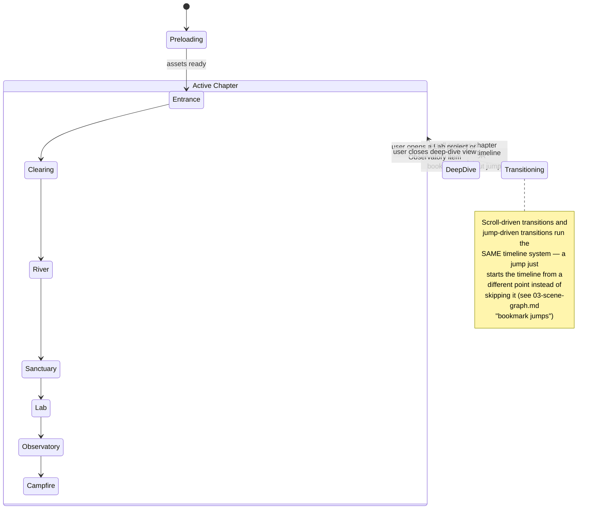
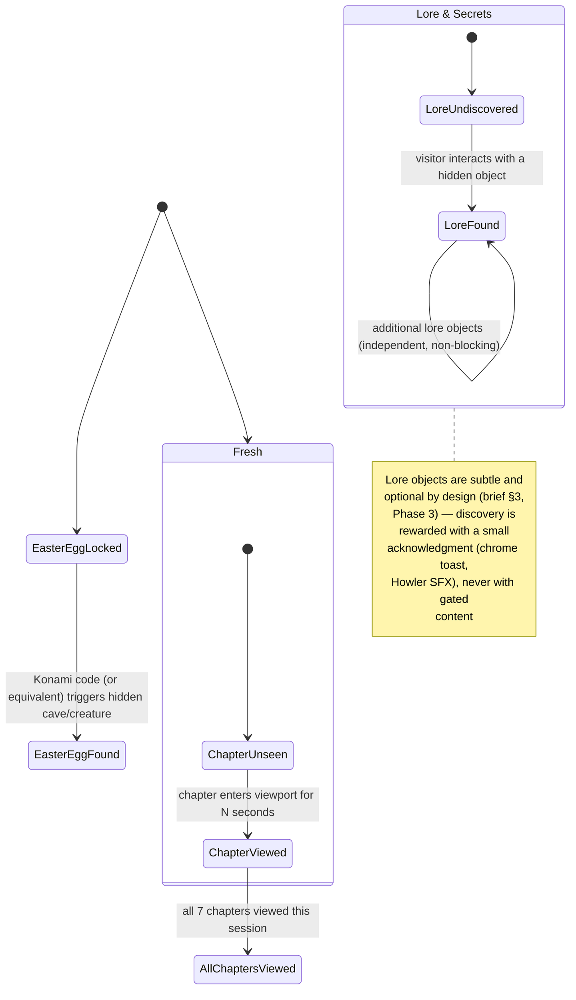

# State Machines

Three independent state machines, all owned by the Zustand world-store (slices pattern — see
[02-architecture.md](./02-architecture.md) `world/state/`). They read from and influence each
other (e.g. navigation state sets a *target* time-of-day per chapter) but are modeled separately
because they change for different reasons and at different rates.

## 1. World time-of-day state

Not a 4-way toggle — a continuous scalar (`timeOfDay: 0–1`) with four **anchor** states the
scalar interpolates between. The state machine below describes *anchors and transition triggers*;
the actual rendered value is always the damped interpolation, never a jump between anchors.

**Rules encoded here:**
- Anchors are driven primarily by **journey/scroll progress** (each chapter has a target
  time-of-day per [03-scene-graph.md](./03-scene-graph.md)), not a wall-clock or real device time
  — the story controls the sky, not the visitor's actual local time.
- A manual override exists (the Phase 4 "smooth dark/light mode" control) — it retargets the
  anchor and the same damped interpolation applies, so a manual toggle still animates gradually
  (multi-second ease), never an instant palette swap.
- Scrolling backward retargets the anchor to the earlier chapter's value using the same damping —
  the sky can move backward in time exactly as smoothly as forward.

## 2. Navigation / scene state

**Rules encoded here:**
- `Transitioning` is a real, observable state (not just an animation happening incidentally) —
  scroll input is soft-throttled (not blocked) during a transition so a fast scroller doesn't
  cause overlapping transitions, but the visitor's own scroll is never hijacked or reversed.
- `DeepDive` (Lab project detail, Observatory item detail) is modeled as a state, not a route
  change, in the immersive experience — it layers UI over the current scene rather than
  navigating away from it, so the visitor's place in the world is never lost. Classic mode is
  free to model the equivalent as an actual route, since it has no world position to preserve.

## 3. Interaction / progress state

Tracks what the visitor has seen and found — purely additive, purely for the visitor's own
sense of progress (a thin progress indicator in the chrome) and to gate the easter egg. Never
gates access to content; nothing is *required* to be "unlocked."

**Persistence:** stored in `localStorage` (not a backend) — this is a memory-of-the-visit
convenience (e.g. "resume where you left off," a subtle "you've seen it all" state for the
progress indicator), not an account system. Cleared on request from the a11y/settings panel.
